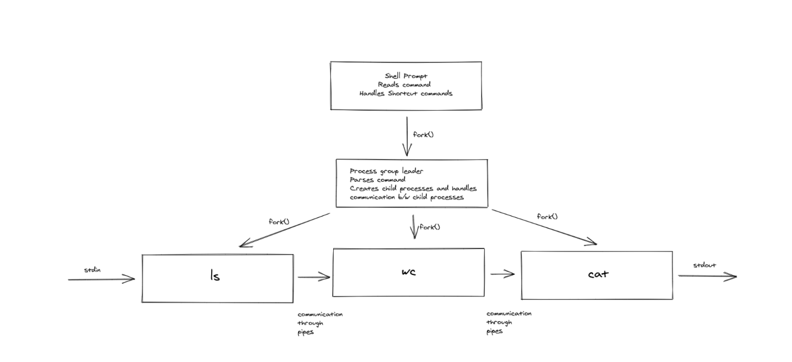
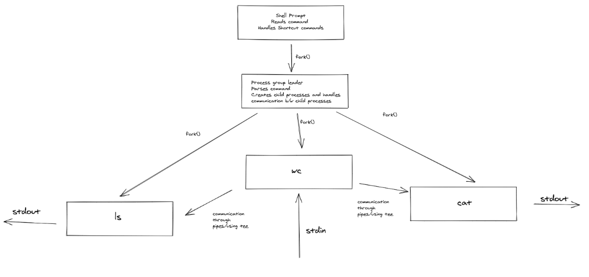

# P1 Build your own Bash-like Shell

This exercise develops a Bash-like shell with support for chaining process via pipes. Shell also includes input-output redirections, foreground and background prcoesses and inlcudes some new functionalities like double piping(||), triple piping (|||) and shortcut mode(sc).

# Design

## Shell

The main shell process is a prompting process which shows the prompt and asks for user input.

On succesfully receiving the command, it passes the command to a newly created process which then parses it. This child process is made the leader of a newlhy created process group and all the child processes related to this command will be in this process group. The shell process checks if the command has a & at the end, if it is not present the terminal control is given to this process group (foreground process).

The child process then parses the command and handle all input and output redirections and maintains a structure for it.

The following figures illustrate working of our shell - 

# Usage

## Chaining commands and Input-Output Redirections

Chaining commands and input-output redirections work as it is like in bash.

    ls | wc | wc
    ls > dir.txt
    ls | wc > count.txt

## Double and Triple Piping

Shell supoports two new pipeline operators || and |||. For example - 

    ls -l || wc, cat
    ls -l ||| wc, cat, wc -m

It means output of ls -l is passed as input to both wc and cat in case of || and similarly output of ls -l is passed to all the three commands in case of |||.

## Short-cut mode

Shell supports a mode called shortu cut mode executed by command `sc`. In this mode, a command can be executed by pressing `Ctrl + C` and then entering a number. This number corresponds to index in lookup table created and deleted by commands `sc -i <ind> <command>` and `sc -d <ind> <command>`.

    sc -i 2 ls | wc
    sc -i 32 ls -l
    sc -d 2 ls | wc

# How to run
    make run_shell