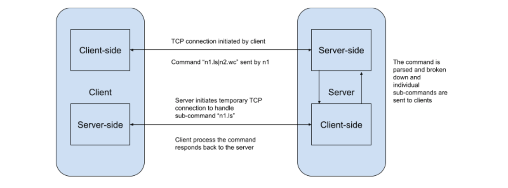

# P2 Cluster Shell

This exercise develops a shell which extends to a cluster of machines operating over the network. There is a central server which coordinates the operations and there are multiple clients/nodes which perform the bash commands and communicate to other nodes via server.

# Design

# Server

The server starts before all other clients and starts listening for connections from the clients. As soon as a node starts the client program, it automatically connects to the server. This connection is used to receive commands from the client and respond back with the output of the command. The entire architecture supports executing different sub-commands on different nodes. The server parses the sub-command and determines where the sub-command needs to be sent for processing. The server then starts a temporary connection with the node and the sub-command is sent and the output is received. The temporary connection is closed.

# Client

The client itself has a client-side and a server-side. The client-side connects to the server as soon as the program is started. The server-side operates on a forked child and starts listening for processing of the sub-commands from the server. Client-side is associated with the shell. As soon as the user enters a command, it is dispatched to the server using the already established TCP connection.

The following figures illustrate working of our shell - 

# Command

The commands are of the form `n1.ls | n2.wc | ...`. The nodes are identified by ‘n’ followed by the node ID. It implies that that particular sub-command is executed on that node. If there is no node identifier, then the command is assumed to be redirected to the self-node (nonetheless, it still passes through the server instead of directly executing). If ‘n*’ is the identifier, then that sub-command is executed in all the nodes. The outputs from all the nodes are then concatenated and piped to the next sub-command by the server. The pipe ‘|’ indicates that the server acts as a common medium for writing to and reading from the nodes. The “nodes” command displays all the nodes participating in the network. It is displayed in the format of “name” and “ip” on each line for each node.

# How to Run:

The following command is run on the server machine. It compiles and runs the server executable.
    
    make run_server

The following command is run on the server machine. It compiles and runs the server executable.
    
    make run_client

To exit the process you can press Ctrl + C, regardless of client or server. 
