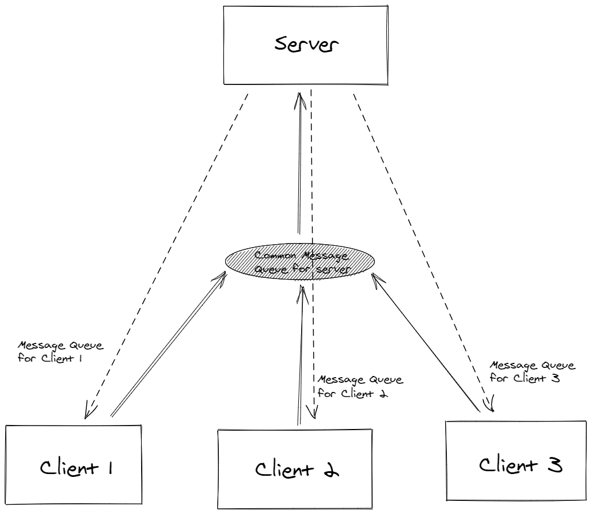

# P3 Group Chat Management System

This exercise develops a group chat system which allows users to create groups, list all groups on the server, join groups, send private and group messages and receive messages in online as well as offline mode. The chat system also implements an option which can be set for a group where users who join a group after `<t>` seconds from the time of message creation also receive it.

# Design

# Server

The server starts before all other clients and has its own message queue. The server coordinates between all the clients. The server receives the message from the queue and based on the type of message, it updates its internal state and sends responses to appropriate clients.

# Client

Every client is uniquely identified by their username which is entered as soon as the client program is launched. The client name cannot be `server`. The client has two threads running. One is a prompting thread which prompts and asks for user input. On receiving the command, it parses and sends the appropriate message to the server message queue. Another is a receiving message thread which reads messages from the client message queue sent by the server and then prints the messages on the terminal.

The following figures illustrate communication between our server and client - 

# Usage

# Creating and Joining group

`create` command is used to create a group and join command is used to join a group. The user who creates the group is already a member of the group.

    create <group_name>
    join <group_name>

# List Groups

This command prints all the created groups, the client waits for the server to return the response. 

    list

# Sending messages

`send` command can be used to send private and group messages with the options `-p` and `-g` respectively.

    send -p <user_name> <msg>
    send -g <group_name> <msg>

# Auto Delete

`auto delete` is a command which allows users to set delete time for a group where users who join a group after `<t>` seconds from the time of message creation also receive it.

    auto delete <group_name> <t>

# How to Run:

The following command is run on the server machine. It compiles and runs the server executable.
    
    make run_server

The following command is run on the server machine. It compiles and runs the server executable.
    
    make run_client

To exit the process you can press Ctrl + C, regardless of client or server. 